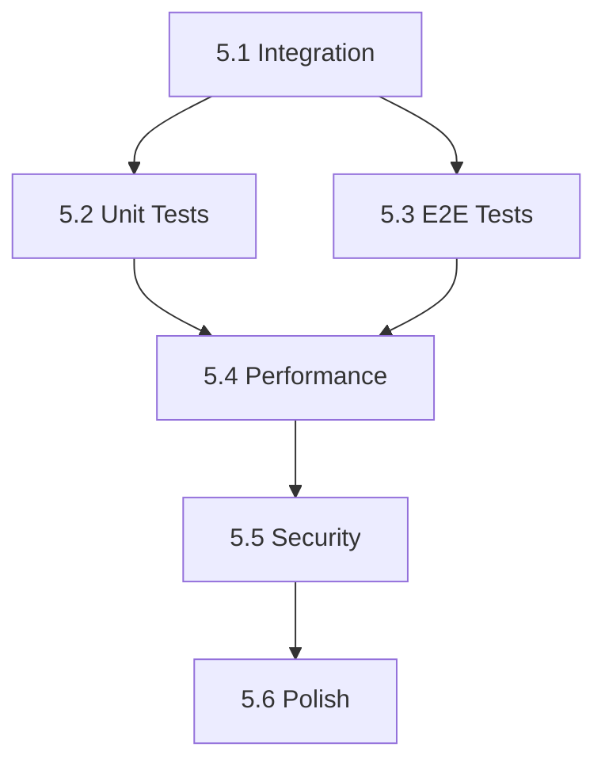

# Phase 5: System Integration, Testing & Production Readiness

## Overview

Phase 5 focuses on integrating all components built in previous phases, comprehensive testing, performance optimization, and preparing the system for production deployment.

**Duration**: 6 sub-phases  
**Focus Areas**: Integration, Testing, Performance, Security, Polish, Deployment

---

## Phase 5 Objectives

### Primary Goals
1. **Full System Integration** - Connect all kernel, browser, and app components
2. **Comprehensive Testing** - Unit tests, integration tests, and end-to-end tests
3. **Performance Optimization** - Memory, CPU, and rendering optimizations
4. **Security Hardening** - Penetration testing and vulnerability fixes
5. **User Experience Polish** - Animations, transitions, accessibility
6. **Production Deployment** - Build system, installer, and documentation

### Success Criteria
- All integration tests pass
- Boot time < 3 seconds
- Memory usage < 256MB for idle system
- No critical security vulnerabilities
- Accessibility WCAG 2.1 AA compliance
- Complete user and developer documentation

---

## Sub-Phase 5.1: Kernel-Browser Integration

### Duration: 1 week

### Objectives
Connect the kernel subsystems with the browser shell to create a unified desktop experience.

### Features to Implement

#### 5.1.1 Process-App Bridge
```
Location: kernel/src/browser/integration.rs
         kpio-browser/src/kernel_bridge.rs
```
- [ ] Process spawning from browser UI
- [ ] App lifecycle management (start, stop, suspend, resume)
- [ ] Window manager integration with kernel display driver
- [ ] IPC channel for browser-kernel communication

#### 5.1.2 File System Integration
```
Location: kpio-browser/src/fs_bridge.rs
```
- [ ] VFS mounting in browser file explorer
- [ ] File operations (read, write, delete, rename)
- [ ] Directory watching for real-time updates
- [ ] Drag-and-drop file operations
- [ ] Clipboard integration for files

#### 5.1.3 Network Stack Integration
```
Location: kpio-browser/src/network_bridge.rs
```
- [ ] Browser using kernel TCP/IP stack
- [ ] DNS resolution through kernel
- [ ] Network status notifications
- [ ] Firewall integration

#### 5.1.4 Input System Integration
```
Location: kpio-browser/src/input_bridge.rs
```
- [ ] Keyboard events from kernel HID
- [ ] Mouse/touchpad events
- [ ] Touch screen support
- [ ] Gamepad support for games

### Tests

| Test ID | Test Name | Description | Expected Result |
|---------|-----------|-------------|-----------------|
| T5.1.1 | ProcessSpawn | Spawn app from launcher | App window appears within 500ms |
| T5.1.2 | FileRead | Read file in explorer | File content displayed correctly |
| T5.1.3 | NetworkFetch | Load webpage | Page renders with kernel network |
| T5.1.4 | KeyboardInput | Type in text editor | Characters appear correctly |
| T5.1.5 | MouseClick | Click desktop icon | Icon selected, context menu works |
| T5.1.6 | DragDrop | Drag file to folder | File moved successfully |

---

## Sub-Phase 5.2: Comprehensive Unit Testing

### Duration: 1 week

### Objectives
Create comprehensive unit test coverage for all modules.

### Test Modules to Create

#### 5.2.1 Kernel Unit Tests
```
Location: kernel/src/tests/
```
- [ ] `memory_tests.rs` - Buddy allocator, slab allocator, paging
- [ ] `process_tests.rs` - Process creation, termination, signals
- [ ] `scheduler_tests.rs` - Task scheduling, priority, preemption
- [ ] `ipc_tests.rs` - Channels, shared memory, message queues
- [ ] `syscall_tests.rs` - All 50+ syscall handlers
- [ ] `fs_tests.rs` - VFS operations, file handles
- [ ] `security_tests.rs` - Capabilities, sandboxing, audit

#### 5.2.2 Browser Unit Tests
```
Location: kpio-browser/src/tests/
```
- [ ] `tab_tests.rs` - Tab creation, switching, closing
- [ ] `navigation_tests.rs` - URL parsing, history, redirects
- [ ] `cookie_tests.rs` - Cookie storage, expiration, security
- [ ] `csp_tests.rs` - Content Security Policy enforcement
- [ ] `extension_tests.rs` - Extension loading, permissions
- [ ] `private_mode_tests.rs` - Session isolation

#### 5.2.3 App Unit Tests
```
Location: kpio-browser/src/apps/tests/
```
- [ ] `desktop_tests.rs` - Window management, wallpaper
- [ ] `file_explorer_tests.rs` - Navigation, operations
- [ ] `terminal_tests.rs` - Command execution, history
- [ ] `text_editor_tests.rs` - Editing, undo/redo
- [ ] `calculator_tests.rs` - All operations, edge cases
- [ ] `settings_tests.rs` - Settings persistence

#### 5.2.4 Parser Unit Tests
```
Location: kpio-html/src/tests/, kpio-css/src/tests/
```
- [ ] HTML tokenizer tests (100+ cases)
- [ ] HTML tree builder tests
- [ ] CSS parser tests
- [ ] CSS selector matching tests
- [ ] JavaScript parser tests (kpio-js)

### Test Coverage Goals

| Module | Target Coverage | Priority |
|--------|----------------|----------|
| Memory Management | 90% | Critical |
| Process Management | 85% | Critical |
| Syscall Handlers | 95% | Critical |
| Browser Core | 80% | High |
| Apps | 70% | Medium |
| Parsers | 85% | High |

### Test Commands
```bash
# Run all kernel tests
cargo test -p kpio-kernel --lib

# Run browser tests  
cargo test -p kpio-browser --lib

# Run with coverage
cargo tarpaulin --all --out Html
```

---

## Sub-Phase 5.3: Integration & E2E Testing

### Duration: 1 week

### Objectives
Test complete user workflows and component interactions.

### Integration Test Scenarios

#### 5.3.1 Boot Sequence Tests
```
Location: tests/integration/boot_tests.rs
```
- [ ] Cold boot to desktop
- [ ] Warm reboot
- [ ] Boot with multiple displays
- [ ] Boot with network available
- [ ] Boot recovery mode

#### 5.3.2 Desktop Workflow Tests
```
Location: tests/integration/desktop_tests.rs
```
- [ ] Login → Desktop → Launch App → Close App → Logout
- [ ] Multiple window management
- [ ] Taskbar interactions
- [ ] System tray notifications
- [ ] Quick settings toggle

#### 5.3.3 Browser Workflow Tests
```
Location: tests/integration/browser_tests.rs
```
- [ ] Open browser → Navigate → Bookmark → Close
- [ ] Multiple tabs with different sites
- [ ] Private browsing session
- [ ] Extension installation and usage
- [ ] Download file → Open in app

#### 5.3.4 File Management Tests
```
Location: tests/integration/file_tests.rs
```
- [ ] Create folder → Create file → Edit → Save
- [ ] Copy/Move between directories
- [ ] Search files
- [ ] Open file with associated app
- [ ] Delete to trash → Restore

#### 5.3.5 Settings Tests
```
Location: tests/integration/settings_tests.rs
```
- [ ] Change theme → Verify UI updates
- [ ] Change language → Verify translations
- [ ] Change wallpaper → Verify display
- [ ] Privacy settings → Verify enforcement

### E2E Test Framework

```rust
// tests/e2e/framework.rs
pub struct E2ETestRunner {
    vm: VirtualMachine,
    screen: ScreenCapture,
    input: InputSimulator,
}

impl E2ETestRunner {
    pub fn boot(&mut self) -> Result<(), E2EError>;
    pub fn click(&mut self, x: i32, y: i32);
    pub fn type_text(&mut self, text: &str);
    pub fn screenshot(&self) -> Image;
    pub fn wait_for_element(&self, selector: &str, timeout_ms: u64);
    pub fn assert_visible(&self, selector: &str) -> bool;
}
```

### Test Execution Matrix

| Scenario | QEMU | VirtualBox | Real Hardware |
|----------|------|------------|---------------|
| Boot | ✓ | ✓ | ✓ |
| Desktop | ✓ | ✓ | ✓ |
| Browser | ✓ | ✓ | Pending |
| Apps | ✓ | ✓ | Pending |
| Network | ✓ | ✓ | ✓ |

---

## Sub-Phase 5.4: Performance Optimization

### Duration: 1 week

### Objectives
Optimize system performance for smooth user experience.

### Performance Targets

| Metric | Current | Target | Method |
|--------|---------|--------|--------|
| Boot Time | TBD | < 3s | Parallel init, lazy loading |
| Memory (Idle) | TBD | < 256MB | Memory pools, compression |
| First Paint | TBD | < 100ms | GPU acceleration |
| Input Latency | TBD | < 16ms | Priority scheduling |
| Tab Open | TBD | < 200ms | Process pooling |

### Optimization Tasks

#### 5.4.1 Memory Optimization
```
Location: kernel/src/memory/
```
- [ ] Implement memory compression (zram-like)
- [ ] Add memory reclamation for inactive pages
- [ ] Optimize slab cache sizes
- [ ] Reduce kernel heap fragmentation
- [ ] Implement copy-on-write for process fork

#### 5.4.2 CPU Optimization
```
Location: kernel/src/scheduler/
```
- [ ] Tune scheduler time slices
- [ ] Implement CPU affinity
- [ ] Add NUMA awareness
- [ ] Optimize context switch overhead
- [ ] Implement tickless idle

#### 5.4.3 Graphics Optimization
```
Location: graphics/src/
```
- [ ] Implement tile-based rendering
- [ ] Add GPU command batching
- [ ] Optimize damage tracking
- [ ] Implement texture atlasing
- [ ] Add frame pacing

#### 5.4.4 I/O Optimization
```
Location: kernel/src/io/
```
- [ ] Tune io_uring parameters
- [ ] Implement read-ahead for files
- [ ] Add write coalescing
- [ ] Optimize syscall path
- [ ] Implement zero-copy networking

### Profiling Tools

```rust
// kernel/src/profiling/mod.rs
pub struct Profiler {
    pub fn start_trace(&mut self, name: &str);
    pub fn end_trace(&mut self);
    pub fn record_metric(&mut self, name: &str, value: u64);
    pub fn generate_report(&self) -> ProfileReport;
}
```

### Benchmark Suite
```bash
# Boot benchmark
./bench/boot_time.sh

# Memory benchmark
./bench/memory_usage.sh

# Rendering benchmark  
./bench/render_fps.sh

# I/O benchmark
./bench/disk_throughput.sh
```

---

## Sub-Phase 5.5: Security Hardening

### Duration: 1 week

### Objectives
Ensure system security through auditing and penetration testing.

### Security Audit Checklist

#### 5.5.1 Kernel Security
- [ ] Stack canaries enabled
- [ ] ASLR implementation verified
- [ ] W^X memory policy enforced
- [ ] Syscall filtering (seccomp-like)
- [ ] Capability system audit
- [ ] No kernel info leaks

#### 5.5.2 Browser Security
- [ ] Same-origin policy verified
- [ ] CSP enforcement tested
- [ ] XSS prevention verified
- [ ] CSRF protection verified
- [ ] Cookie security (HttpOnly, Secure, SameSite)
- [ ] Mixed content blocking

#### 5.5.3 App Sandboxing
- [ ] Process isolation verified
- [ ] File system access restricted
- [ ] Network access controlled
- [ ] IPC permissions enforced
- [ ] Resource limits working

### Penetration Tests

| Test ID | Category | Test | Expected |
|---------|----------|------|----------|
| PT-01 | Memory | Buffer overflow attempt | Blocked |
| PT-02 | Memory | Use-after-free | Crash, no exploit |
| PT-03 | Syscall | Invalid syscall number | EINVAL |
| PT-04 | Syscall | Kernel pointer access | EFAULT |
| PT-05 | Browser | XSS injection | Sanitized |
| PT-06 | Browser | CSP bypass attempt | Blocked |
| PT-07 | IPC | Unauthorized channel access | EPERM |
| PT-08 | FS | Path traversal | Blocked |

### Security Fixes Template
```rust
// Document each security fix
/// Security Fix: CVE-KPIO-2026-XXXX
/// 
/// **Vulnerability**: Description
/// **Impact**: Severity (Critical/High/Medium/Low)
/// **Fix**: What was changed
/// **Test**: How to verify the fix
```

### Fuzzing Campaigns
```bash
# Syscall fuzzing
cargo fuzz run syscall_fuzz

# HTML parser fuzzing
cargo fuzz run html_parser_fuzz

# Network packet fuzzing
cargo fuzz run network_fuzz
```

---

## Sub-Phase 5.6: Polish & Deployment

### Duration: 1 week

### Objectives
Final polish, documentation, and deployment preparation.

### UI/UX Polish

#### 5.6.1 Animations
```
Location: kpio-browser/src/design/animations.rs
```
- [ ] Window open/close animations (200ms ease-out)
- [ ] Tab switching transitions
- [ ] Menu fade in/out
- [ ] Button hover states
- [ ] Loading spinners
- [ ] Progress indicators

#### 5.6.2 Accessibility
```
Location: kpio-browser/src/a11y/
```
- [ ] Screen reader announcements
- [ ] Keyboard navigation complete
- [ ] Focus indicators visible
- [ ] Color contrast WCAG AA
- [ ] Reduced motion support
- [ ] High contrast theme

#### 5.6.3 Localization
```
Location: kpio-browser/src/i18n/
```
- [ ] English (en-US) - Complete
- [ ] Korean (ko-KR) - Complete
- [ ] Japanese (ja-JP) - Partial
- [ ] Chinese Simplified (zh-CN) - Partial
- [ ] RTL language support tested

### Documentation

#### 5.6.4 User Documentation
```
Location: docs/user/
```
- [ ] Getting Started Guide
- [ ] Desktop User Manual
- [ ] Browser User Manual
- [ ] Keyboard Shortcuts Reference
- [ ] Troubleshooting Guide
- [ ] FAQ

#### 5.6.5 Developer Documentation
```
Location: docs/developer/
```
- [ ] Architecture Overview
- [ ] Kernel API Reference
- [ ] Browser Extension API
- [ ] App Development Guide
- [ ] Contributing Guidelines
- [ ] Code Style Guide

#### 5.6.6 API Documentation
```bash
# Generate rustdoc
cargo doc --all --no-deps --document-private-items

# Serve documentation
python -m http.server --directory target/doc 8080
```

### Deployment

#### 5.6.7 Build System
```
Location: build/
```
- [ ] ISO image generation script
- [ ] USB bootable image creation
- [ ] UEFI boot support
- [ ] Secure Boot signing (optional)
- [ ] Reproducible builds

#### 5.6.8 Installer
```
Location: installer/
```
- [ ] Disk partitioning
- [ ] File system formatting
- [ ] Bootloader installation
- [ ] First-run setup wizard
- [ ] Recovery partition

#### 5.6.9 Release Checklist
- [ ] Version number updated
- [ ] Changelog written
- [ ] Release notes prepared
- [ ] Checksums generated
- [ ] Digital signatures
- [ ] Release announcement drafted

### Release Artifacts

| Artifact | Description | Size (est.) |
|----------|-------------|-------------|
| kpio-os-x86_64.iso | Bootable ISO | ~200MB |
| kpio-os-x86_64.img | USB image | ~200MB |
| kpio-os-src.tar.gz | Source tarball | ~50MB |
| kpio-os-docs.tar.gz | Documentation | ~20MB |

---

## Phase 5 Timeline

```
Week 1: Sub-Phase 5.1 - Kernel-Browser Integration
Week 2: Sub-Phase 5.2 - Unit Testing
Week 3: Sub-Phase 5.3 - Integration & E2E Testing
Week 4: Sub-Phase 5.4 - Performance Optimization
Week 5: Sub-Phase 5.5 - Security Hardening
Week 6: Sub-Phase 5.6 - Polish & Deployment
```

## Dependencies



## Risk Assessment

| Risk | Probability | Impact | Mitigation |
|------|-------------|--------|------------|
| Integration bugs | High | Medium | Incremental integration |
| Performance miss | Medium | High | Early profiling |
| Security vuln | Medium | Critical | Fuzzing, audits |
| Schedule slip | Medium | Medium | Buffer time, scope cuts |

## Exit Criteria for Phase 5

1. ✅ All integration tests pass
2. ✅ Unit test coverage > 75%
3. ✅ No critical/high security issues
4. ✅ Performance targets met
5. ✅ Documentation complete
6. ✅ ISO image boots successfully
7. ✅ First-run experience works

---

## Next Steps After Phase 5

- **Phase 6**: Advanced Features (multi-user, cloud sync, app store)
- **Phase 7**: Hardware Support (more drivers, ARM port)
- **Phase 8**: Ecosystem (third-party apps, themes, extensions)
