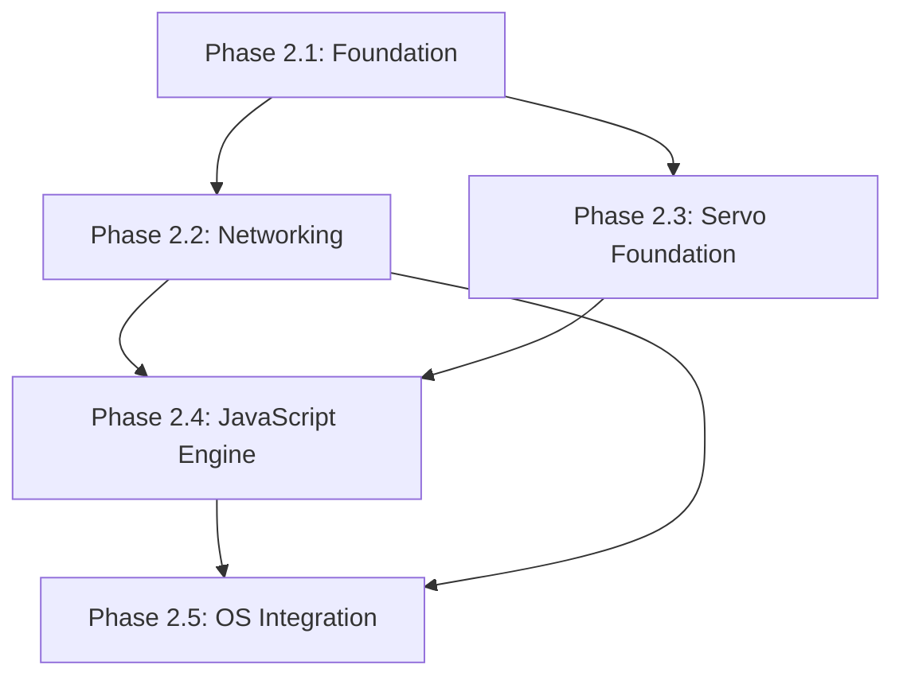

# Phase 2: Browser Integration Implementation Plan

**Document Version:** 1.0.0  
**Created:** 2026-01-27  
**Status:** Draft for Review

---

## Executive Summary

Phase 2 focuses on integrating a Servo-based browser engine with deep OS-level optimizations. Based on my analysis of the current codebase and the roadmap, this document outlines the implementation strategy, gaps to address, and detailed milestones.

---

## Current State Analysis

### What's Already Implemented ✅

| Component | Location | Status |
|-----------|----------|--------|
| HTML Parser (kpio-html) | `kpio-html/src/parser.rs` | Functional - parses HTML to DOM tree |
| CSS Parser (kpio-css) | `kpio-css/src/parser.rs` | Functional - parses stylesheets |
| DOM Tree (kpio-dom) | `kpio-dom/src/` | Functional - node, element, document |
| Layout Engine (kpio-layout) | `kpio-layout/src/` | Functional - block, inline, flex layouts |
| Rendering Pipeline | `kpio-browser/src/pipeline.rs` | Functional - HTML → DisplayList → Framebuffer |
| JavaScript Engine (kpio-js) | `kpio-js/src/` | Basic - lexer, parser, interpreter |
| Servo Platform Layer | `servo-platform/src/` | Stubs - net, gpu, fs, thread, ipc |
| Kernel Browser Module | `kernel/src/browser/` | Stubs - protocol, coordinator, gpu |
| Tab Management | `kpio-browser/src/tabs.rs` | Basic structure |

### What's Missing ❌

| Component | Gap | Priority |
|-----------|-----|----------|
| Servo Integration | html5ever, Stylo, WebRender not integrated | Critical |
| SpiderMonkey | Full JS engine not ported | Critical |
| GPU Rendering | WebRender + Vulkan pipeline | Critical |
| IPC System | Fully functional capability-based IPC | High |
| Network Stack | smoltcp integration incomplete | High |
| WASI Preview 2 | File system, sockets not complete | High |
| VFS Layer | Mount table, ext4 read/write | Medium |

---

## Architecture Overview

```
┌─────────────────────────────────────────────────────────────────┐
│                    PHASE 2 TARGET ARCHITECTURE                   │
├─────────────────────────────────────────────────────────────────┤
│                                                                  │
│  ┌──────────────┐  ┌──────────────┐  ┌──────────────────────┐  │
│  │  Browser Tab │  │  Browser Tab │  │   System Services    │  │
│  │   (Servo)    │  │   (Servo)    │  │  (WASM Userspace)   │  │
│  └──────┬───────┘  └──────┬───────┘  └──────────┬───────────┘  │
│         │                  │                     │              │
│         └──────────┬───────┴─────────────────────┘              │
│                    │                                             │
│         ┌──────────▼──────────┐                                 │
│         │   Browser Coordinator │                                │
│         │   (kernel/browser)    │                                │
│         └──────────┬──────────┘                                 │
│                    │                                             │
│  ┌─────────────────┼─────────────────────────────────────────┐  │
│  │                 │         KERNEL                           │  │
│  ├─────────────────┼─────────────────────────────────────────┤  │
│  │   ┌─────────────▼─────────────┐                           │  │
│  │   │        IPC System          │                           │  │
│  │   │   (Capability-Based)       │                           │  │
│  │   └─────────────┬─────────────┘                           │  │
│  │                 │                                          │  │
│  │   ┌─────────────┴─────────────────────────────┐           │  │
│  │   │                                            │           │  │
│  │   ▼                    ▼                       ▼           │  │
│  │ ┌──────┐         ┌───────────┐          ┌──────────┐      │  │
│  │ │ GPU  │         │  Network  │          │   VFS    │      │  │
│  │ │Driver│         │  (smoltcp)│          │ (ext4...)│      │  │
│  │ └──────┘         └───────────┘          └──────────┘      │  │
│  └───────────────────────────────────────────────────────────┘  │
└─────────────────────────────────────────────────────────────────┘
```

---

## Implementation Phases

### Phase 2.1: Foundation (Weeks 1-4)

**Goal:** Complete IPC system and basic WASI to enable userspace services

#### Tasks

- [ ] **2.1.1 Complete IPC Channel Implementation**
  - Location: `kernel/src/ipc/channel.rs`
  - Implement async send/receive with blocking
  - Add capability validation on every operation
  - Add shared memory regions for large transfers

- [ ] **2.1.2 Service Registry**
  - Location: `kernel/src/ipc/services.rs` (new)
  - Create named service registration
  - Implement service discovery
  - Add VFS, Network, Display service stubs

- [ ] **2.1.3 WASI Filesystem Implementation**
  - Location: `runtime/src/wasi.rs`
  - Implement: `fd_read`, `fd_write`, `fd_seek`, `fd_close`
  - Implement: `path_open`, `path_create_directory`, `path_remove`
  - Implement: `fd_readdir`, `fd_prestat_get`

- [ ] **2.1.4 VFS Layer**
  - Location: `storage/src/vfs.rs` (new)
  - Mount table implementation
  - Path resolution with longest-prefix matching
  - Filesystem trait abstraction

#### Success Criteria
- [ ] Two WASM modules can exchange messages via IPC
- [ ] Simple WASM shell can list directories
- [ ] Capability permission checks work

---

### Phase 2.2: Networking (Weeks 5-8)

**Goal:** Full TCP/IP stack with HTTP capability

#### Tasks

- [ ] **2.2.1 smoltcp Integration**
  - Location: `network/src/interface.rs`
  - VirtIO-Net device integration
  - Interface configuration (IP, gateway)
  - Socket management

- [ ] **2.2.2 TCP Socket API**
  - Location: `network/src/tcp.rs`
  - Connect, listen, accept
  - Send/receive with proper state machine
  - Connection cleanup

- [ ] **2.2.3 UDP Socket API**
  - Location: `network/src/udp.rs`
  - Bind, send_to, recv_from

- [ ] **2.2.4 DNS Resolver**
  - Location: `network/src/dns.rs`
  - UDP-based DNS queries
  - Response parsing
  - Cache layer

- [ ] **2.2.5 DHCP Client**
  - Location: `network/src/dhcp.rs`
  - IP address acquisition
  - Gateway/DNS configuration

- [ ] **2.2.6 HTTP Client**
  - Location: `network/src/http.rs`
  - GET/POST requests
  - Chunked encoding support
  - Basic header parsing

#### Success Criteria
- [ ] `wget`-like WASM app can download a file
- [ ] DNS resolution works
- [ ] DHCP assigns IP automatically in QEMU

---

### Phase 2.3: Servo Foundation (Weeks 9-12)

**Goal:** Integrate Servo's core parsing and rendering components

#### Tasks

- [ ] **2.3.1 html5ever Integration**
  - Replace `kpio-html` with Servo's html5ever
  - Adapt tree builder to work with `kpio-dom`
  - Handle fragment parsing

- [ ] **2.3.2 Stylo Integration**
  - Port Servo's style engine
  - Connect to `kpio-dom` for style computation
  - Implement computed values storage

- [ ] **2.3.3 WebRender Preparation**
  - Port display list builder from Servo
  - Prepare Vulkan backend integration
  - Design zero-copy texture upload path

- [ ] **2.3.4 DOM Event System**
  - Implement event bubbling/capturing
  - Add common event types (click, input, keydown)
  - Connect to input subsystem

#### Success Criteria
- [ ] html5ever parses complex HTML correctly
- [ ] Stylo computes styles for CSS3 layouts
- [ ] DOM events fire and propagate

---

### Phase 2.4: JavaScript Engine (Weeks 13-16)

**Goal:** Full JavaScript execution via SpiderMonkey

#### Tasks

- [ ] **2.4.1 SpiderMonkey Build System**
  - Cross-compile SpiderMonkey for no_std (partial)
  - Create FFI bindings in Rust
  - Handle memory management bridge

- [ ] **2.4.2 DOM Bindings**
  - Implement document, window objects
  - Element API (querySelector, innerHTML, etc.)
  - Event listener registration

- [ ] **2.4.3 WASM Integration**
  - Connect SpiderMonkey WASM to shared runtime
  - Enable AOT caching for browser WASM
  - Implement WebAssembly JS API

- [ ] **2.4.4 Event Loop**
  - Implement microtask queue
  - setTimeout/setInterval
  - requestAnimationFrame

#### Success Criteria
- [ ] Basic JavaScript executes
- [ ] DOM manipulation works
- [ ] Browser WASM runs correctly

---

### Phase 2.5: OS Integration (Weeks 17-20)

**Goal:** Kernel-level optimizations that differentiate KPIO

#### Tasks

- [ ] **2.5.1 Tab = Process Model**
  - Each tab runs as separate WASM process
  - Capability inheritance for child frames
  - IPC between parent/child frames

- [ ] **2.5.2 GPU Scheduler Integration**
  - Location: `kernel/src/browser/gpu.rs`
  - Foreground tab priority boost
  - Background tab GPU throttling
  - Video playback detection

- [ ] **2.5.3 Memory Pressure Handling**
  - Tab memory tracking
  - Background tab compression
  - Disk swap for inactive tabs

- [ ] **2.5.4 Kernel-Level Ad Blocking**
  - DNS-level blocking
  - Network request filtering
  - Blocklist management via IPC

#### Success Criteria
- [ ] Memory per tab 50% less than Chrome
- [ ] Tab cold start under 1 second
- [ ] Background tabs properly suspended

---

## Dependencies

### External Dependencies

| Dependency | Version | Usage |
|------------|---------|-------|
| servo/html5ever | 0.26+ | HTML parsing |
| servo/selectors | 0.24+ | CSS selectors |
| servo/style | Custom port | Stylo CSS engine |
| smoltcp | 0.11 | TCP/IP stack |
| wasmi | 0.31+ | WASM interpreter |
| SpiderMonkey | 115+ ESR | JavaScript engine |

### Internal Dependencies



---

## Risk Assessment

| Risk | Probability | Impact | Mitigation |
|------|-------------|--------|------------|
| SpiderMonkey port complexity | High | Critical | Start with simpler JS engine fallback |
| Stylo dependency graph | Medium | High | Incremental port, feature flags |
| smoltcp no_std compatibility | Low | Medium | Already proven in embedded |
| Memory constraints | Medium | High | Aggressive pooling, compression |

---

## Testing Strategy

### Unit Tests
- Each module should have inline tests
- Run via `cargo test` on host

### Integration Tests
- QEMU-based tests for kernel components
- CI pipeline with timeout guards

### Web Platform Tests
- Port subset of WPT for HTML/CSS/JS
- Focus on high-value test cases

---

## Next Steps

1. **Review this plan** with stakeholders
2. **Prioritize Phase 2.1** tasks for immediate execution
3. **Set up CI** for new components
4. **Create tracking issues** for each task

---

## Appendix: File Structure for Phase 2

```
kernel/
  src/
    ipc/
      channel.rs      ← Enhanced
      capability.rs   ← Enhanced
      message.rs      ← Enhanced
      services.rs     ← NEW
      shm.rs          ← Enhanced
    browser/
      coordinator.rs  ← Enhanced
      gpu.rs          ← Enhanced
      network.rs      ← Enhanced
      memory.rs       ← NEW
      adblocker.rs    ← NEW
    net/
      interface.rs    ← NEW
      tcp.rs          ← NEW
      udp.rs          ← NEW

network/
  src/
    interface.rs      ← Enhanced
    tcp.rs            ← Enhanced
    dns.rs            ← Enhanced
    dhcp.rs           ← Enhanced
    http.rs           ← Enhanced

runtime/
  src/
    wasi.rs           ← Enhanced (full WASI)
    wasi/
      fs.rs           ← NEW
      net.rs          ← NEW
      clock.rs        ← Enhanced

storage/
  src/
    vfs.rs            ← NEW
    mount.rs          ← NEW

servo-integration/   ← NEW crate
  Cargo.toml
  src/
    lib.rs
    html5ever.rs
    stylo.rs
    webrender.rs
    spidermonkey.rs
```
