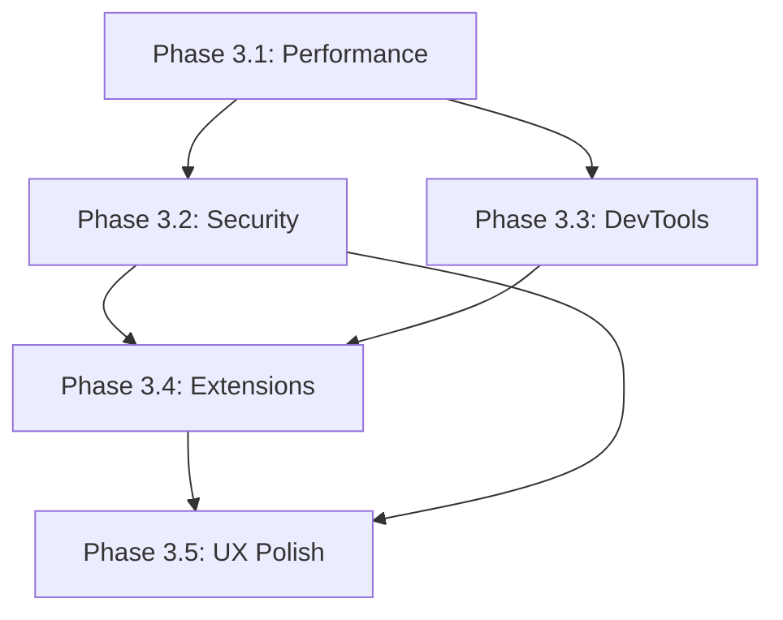

# Phase 3: Production-Ready Browser OS Implementation Plan

**Document Version:** 1.0.0  
**Created:** 2026-01-27  
**Status:** Planning  
**Prerequisite:** Phase 2 Completed

---

## Executive Summary

Phase 3 transforms KPIO from a functional browser-OS prototype into a production-ready system. This phase focuses on performance optimization, security hardening, developer tools, and user experience polish. By the end of Phase 3, KPIO should be suitable for daily driver usage.

---

## Phase 2 Completion Status ✅

| Component | Location | Status |
|-----------|----------|--------|
| IPC Service Registry | `kernel/src/ipc/services.rs` | ✅ Complete |
| WASI Filesystem (Preview 2) | `runtime/src/wasi.rs` | ✅ Complete |
| DOM Event System | `kpio-dom/src/events.rs` | ✅ Complete |
| Tab Memory Management | `kernel/src/browser/memory.rs` | ✅ Complete |
| HTTP Client | `network/src/http.rs` | ✅ Complete |
| WebSocket | `network/src/websocket.rs` | ✅ Complete |
| Capability Rights (CONNECT) | `kernel/src/ipc/capability.rs` | ✅ Complete |

---

## Phase 3 Architecture

```
┌─────────────────────────────────────────────────────────────────────────────┐
│                       PHASE 3 TARGET ARCHITECTURE                            │
├─────────────────────────────────────────────────────────────────────────────┤
│                                                                              │
│  ┌─────────────────────────────────────────────────────────────────────┐   │
│  │                         USER EXPERIENCE LAYER                        │   │
│  │  ┌─────────┐  ┌──────────┐  ┌────────────┐  ┌──────────────────┐   │   │
│  │  │ Tab Bar │  │ Settings │  │ Extensions │  │ Developer Tools  │   │   │
│  │  │   UI    │  │   Panel  │  │   Engine   │  │ (Inspect/Debug)  │   │   │
│  │  └────┬────┘  └────┬─────┘  └─────┬──────┘  └────────┬─────────┘   │   │
│  └───────┴────────────┴──────────────┴──────────────────┴─────────────┘   │
│                                      │                                     │
│  ┌─────────────────────────────────────────────────────────────────────┐   │
│  │                         BROWSER ENGINE LAYER                         │   │
│  │  ┌──────────────┐  ┌───────────────┐  ┌─────────────────────────┐   │   │
│  │  │   Servo      │  │   JavaScript  │  │      WebRender          │   │   │
│  │  │  (html5ever, │  │ (SpiderMonkey │  │  (GPU Accelerated       │   │   │
│  │  │   Stylo)     │  │  or V8 port)  │  │   Composition)          │   │   │
│  │  └──────┬───────┘  └───────┬───────┘  └───────────┬─────────────┘   │   │
│  └─────────┴──────────────────┴──────────────────────┴─────────────────┘   │
│                                      │                                     │
│  ┌─────────────────────────────────────────────────────────────────────┐   │
│  │                         SECURITY LAYER                               │   │
│  │  ┌──────────────┐  ┌──────────────┐  ┌──────────────────────────┐   │   │
│  │  │   Sandbox    │  │    Origin    │  │    Content Security      │   │   │
│  │  │  Hardening   │  │   Isolation  │  │      Policy (CSP)        │   │   │
│  │  └──────────────┘  └──────────────┘  └──────────────────────────┘   │   │
│  └─────────────────────────────────────────────────────────────────────┘   │
│                                      │                                     │
│  ┌─────────────────────────────────────────────────────────────────────┐   │
│  │                         KERNEL LAYER                                 │   │
│  │  ┌─────────┐  ┌──────────┐  ┌─────────┐  ┌─────────┐  ┌─────────┐   │   │
│  │  │Scheduler│  │  Memory  │  │   GPU   │  │ Network │  │ Storage │   │   │
│  │  │   +     │  │ Manager  │  │  Driver │  │  Stack  │  │   VFS   │   │   │
│  │  │Priority │  │  + OOM   │  │ +Vulkan │  │+Firewall│  │  +ext4  │   │   │
│  │  └─────────┘  └──────────┘  └─────────┘  └─────────┘  └─────────┘   │   │
│  └─────────────────────────────────────────────────────────────────────┘   │
│                                                                              │
└─────────────────────────────────────────────────────────────────────────────┘
```

---

## Implementation Phases

### Phase 3.1: Performance Optimization (Weeks 1-6)

**Goal:** Achieve or exceed Chrome's performance metrics

#### Tasks

- [ ] **3.1.1 WASM JIT Compiler**
  - Location: `runtime/src/jit/` (new)
  - Implement baseline JIT for hot functions
  - AOT compilation for system services
  - Profile-guided optimization hints
  - Expected: 10-50x speedup over interpreter

- [ ] **3.1.2 GPU Rendering Pipeline (WebRender)**
  - Location: `graphics/src/webrender/` (new)
  - Port WebRender's display list builder
  - Vulkan backend with tile-based rendering
  - Zero-copy texture upload via shared memory
  - Hardware-accelerated video decode path

- [ ] **3.1.3 Memory Allocator Optimization**
  - Location: `kernel/src/memory/slab.rs` (new)
  - Slab allocator for fixed-size objects
  - Per-CPU caches to reduce lock contention
  - NUMA-aware allocation for multi-socket

- [ ] **3.1.4 I/O Subsystem**
  - Location: `kernel/src/io/async.rs` (new)
  - io_uring-style async I/O
  - Scatter-gather DMA for network
  - Page cache with read-ahead

- [ ] **3.1.5 Parallel Layout Engine**
  - Location: `kpio-layout/src/parallel.rs` (new)
  - Work-stealing for layout tree
  - Rayon-style parallelism
  - Incremental layout for mutations

#### Benchmarks

| Metric | Chrome | KPIO Target |
|--------|--------|-------------|
| Page load (reddit.com) | 2.1s | < 1.5s |
| Memory per tab (avg) | 80MB | < 40MB |
| Cold tab restore | 1.2s | < 0.5s |
| JavaScript (Octane) | 30,000 | > 25,000 |

---

### Phase 3.2: Security Hardening (Weeks 7-12)

**Goal:** Defense-in-depth security model

#### Tasks

- [ ] **3.2.1 Sandbox Hardening**
  - Location: `kernel/src/security/sandbox.rs` (new)
  - Seccomp-BPF style syscall filtering
  - Capability deny-by-default
  - Resource limits (CPU, memory, network)
  - File system namespace isolation

- [ ] **3.2.2 Origin Isolation**
  - Location: `kernel/src/browser/origin.rs` (new)
  - Site isolation (each origin = process)
  - Cross-origin read blocking (CORB)
  - Cross-origin opener policy (COOP)
  - Cross-origin embedder policy (COEP)

- [ ] **3.2.3 Content Security Policy (CSP)**
  - Location: `kpio-browser/src/csp.rs` (new)
  - CSP header parsing
  - Script/style/image source validation
  - Report-only mode for debugging

- [ ] **3.2.4 Certificate Handling**
  - Location: `network/src/tls/` (new)
  - TLS 1.3 via rustls
  - Certificate chain validation
  - Certificate transparency checking
  - HSTS preload list

- [ ] **3.2.5 Kernel Hardening**
  - Location: `kernel/src/security/`
  - KASLR (Kernel Address Space Layout Randomization)
  - Stack canaries and guard pages
  - Control flow integrity (CFI)
  - Kernel memory protection (SMAP/SMEP)

#### Security Audit Checklist

- [ ] All IPC validated for capability rights
- [ ] No buffer overflows in parsing code
- [ ] No use-after-free in DOM operations
- [ ] Fuzzing coverage > 80% for parsers

---

### Phase 3.3: Developer Tools (Weeks 13-18)

**Goal:** Comprehensive browser development environment

#### Tasks

- [ ] **3.3.1 Inspector Panel**
  - Location: `kpio-devtools/src/inspector.rs` (new crate)
  - DOM tree viewer with live editing
  - Computed styles display
  - Box model visualization
  - Accessibility tree

- [ ] **3.3.2 JavaScript Console**
  - Location: `kpio-devtools/src/console.rs`
  - REPL with syntax highlighting
  - Object inspection and expansion
  - Error stack traces with source maps
  - console.log/warn/error support

- [ ] **3.3.3 Network Panel**
  - Location: `kpio-devtools/src/network.rs`
  - Request/response timeline
  - Headers and body inspection
  - WebSocket message viewer
  - HAR export

- [ ] **3.3.4 Performance Profiler**
  - Location: `kpio-devtools/src/profiler.rs`
  - CPU flame graphs
  - Memory allocation tracking
  - Layout thrashing detection
  - Paint timing visualization

- [ ] **3.3.5 Debugger Integration**
  - Location: `kpio-devtools/src/debugger.rs`
  - JavaScript breakpoints
  - Step in/over/out
  - Watch expressions
  - Call stack navigation

#### DevTools Architecture

```
┌─────────────────────────────────────────────────────────────────┐
│                      DevTools Frontend                          │
│  ┌──────────┐ ┌─────────┐ ┌─────────┐ ┌──────────┐ ┌─────────┐ │
│  │ Elements │ │ Console │ │ Network │ │ Sources  │ │  Perf   │ │
│  └────┬─────┘ └────┬────┘ └────┬────┘ └────┬─────┘ └────┬────┘ │
└───────┴────────────┴───────────┴───────────┴────────────┴──────┘
        │            │           │           │            │
        └────────────┴───────────┴───────────┴────────────┘
                                 │
                    ┌────────────▼────────────┐
                    │   Chrome DevTools       │
                    │     Protocol (CDP)      │
                    └────────────┬────────────┘
                                 │ IPC
                    ┌────────────▼────────────┐
                    │     DevTools Agent      │
                    │   (per inspected tab)   │
                    └─────────────────────────┘
```

---

### Phase 3.4: Extension System (Weeks 19-24)

**Goal:** Chrome extension compatibility

#### Tasks

- [ ] **3.4.1 Extension Manifest Parser**
  - Location: `kpio-extensions/src/manifest.rs` (new crate)
  - Manifest V3 parsing
  - Permission declaration handling
  - Content script configuration

- [ ] **3.4.2 Extension Sandbox**
  - Location: `kpio-extensions/src/sandbox.rs`
  - Isolated WASM world per extension
  - Message passing to content scripts
  - API access based on permissions

- [ ] **3.4.3 Browser APIs**
  - Location: `kpio-extensions/src/api/`
  - chrome.tabs API
  - chrome.runtime API
  - chrome.storage API
  - chrome.webRequest API (for adblockers)

- [ ] **3.4.4 Extension Store Integration**
  - Location: `kpio-extensions/src/store.rs`
  - CRX file parsing and installation
  - Update mechanism
  - Extension signature verification

- [ ] **3.4.5 Content Script Injection**
  - Location: `kpio-extensions/src/content.rs`
  - Match pattern evaluation
  - Script injection timing
  - Isolated world communication

#### Extension Priority List

| Extension | Complexity | Priority |
|-----------|------------|----------|
| uBlock Origin | High | Critical |
| 1Password | Medium | High |
| Dark Reader | Low | Medium |
| React DevTools | Medium | Medium |

---

### Phase 3.5: User Experience (Weeks 25-30)

**Goal:** Daily driver ready

#### Tasks

- [ ] **3.5.1 Tab Management UI**
  - Location: `kpio-browser/src/ui/tabs.rs`
  - Tab strip with drag-and-drop
  - Tab grouping and colors
  - Tab search and switching
  - Session restore

- [ ] **3.5.2 Settings Panel**
  - Location: `kpio-browser/src/ui/settings.rs`
  - Privacy settings
  - Appearance themes
  - Search engine selection
  - Default browser registration

- [ ] **3.5.3 Bookmark Manager**
  - Location: `kpio-browser/src/ui/bookmarks.rs`
  - Bookmark bar
  - Folder organization
  - Import/export (Chrome format)
  - Sync preparation

- [ ] **3.5.4 History**
  - Location: `kpio-browser/src/ui/history.rs`
  - Chronological view
  - Search functionality
  - Clear browsing data

- [ ] **3.5.5 Downloads**
  - Location: `kpio-browser/src/ui/downloads.rs`
  - Download progress
  - Pause/resume
  - Virus scan integration hook

- [ ] **3.5.6 Print**
  - Location: `kpio-browser/src/print.rs`
  - Print preview
  - PDF generation
  - Printer discovery

#### Keyboard Shortcuts

| Shortcut | Action |
|----------|--------|
| Ctrl+T | New tab |
| Ctrl+W | Close tab |
| Ctrl+Tab | Next tab |
| Ctrl+L | Focus address bar |
| Ctrl+F | Find in page |
| F12 | Open DevTools |
| Ctrl+Shift+Delete | Clear browsing data |

---

## Dependencies

### New External Dependencies

| Dependency | Version | Usage |
|------------|---------|-------|
| rustls | 0.21+ | TLS 1.3 |
| webpki | 0.22+ | Certificate validation |
| cranelift | 0.100+ | WASM JIT compiler |
| ash | 0.37+ | Vulkan bindings |
| font-kit | 0.11+ | System font loading |

### Phase Dependencies



---

## Risk Assessment

| Risk | Probability | Impact | Mitigation |
|------|-------------|--------|------------|
| JIT security vulnerabilities | High | Critical | Extensive fuzzing, formal verification for critical paths |
| Extension API incompatibility | Medium | High | Focus on most-used APIs, document differences |
| Performance regression | Medium | Medium | Continuous benchmarking, regression tests |
| Memory leaks | Medium | High | Periodic valgrind-style analysis |

---

## Success Metrics

### Performance
- [ ] Page load time < 1.5s for top 100 websites
- [ ] Memory usage < 40MB per tab (average)
- [ ] Smooth scrolling at 60 FPS
- [ ] Tab cold-start < 500ms

### Security
- [ ] Zero critical vulnerabilities in security audit
- [ ] All sandbox escapes mitigated
- [ ] TLS 1.3 only (no fallback)

### Compatibility
- [ ] 95% of top 1000 websites render correctly
- [ ] Top 10 extensions work out of box
- [ ] Web Platform Tests pass rate > 90%

### User Experience
- [ ] System can be used as daily driver
- [ ] Settings persist across reboots
- [ ] Session restore works reliably

---

## Testing Strategy

### Automated Testing
- Unit tests for all new modules
- Integration tests in QEMU
- Fuzzing for all parsers (html, css, js, json)
- Web Platform Tests (WPT) subset

### Manual Testing
- Daily driver testing by team
- Website compatibility testing
- Extension testing

### Performance Testing
- Continuous benchmarking in CI
- A/B testing for optimizations
- Memory profiling with DHAT

---

## Appendix: File Structure for Phase 3

```
kernel/
  src/
    security/
      sandbox.rs     ← NEW: Process sandboxing
      cfi.rs         ← NEW: Control flow integrity
      kaslr.rs       ← NEW: Address randomization
    io/
      async.rs       ← NEW: Async I/O subsystem
      uring.rs       ← NEW: io_uring style interface
    memory/
      slab.rs        ← NEW: Slab allocator
      numa.rs        ← NEW: NUMA awareness
    browser/
      origin.rs      ← NEW: Origin isolation

graphics/
  src/
    webrender/       ← NEW directory
      display_list.rs
      compositor.rs
      vulkan.rs

runtime/
  src/
    jit/             ← NEW directory
      compiler.rs
      codegen.rs
      cache.rs

network/
  src/
    tls/             ← NEW directory
      handshake.rs
      cert.rs

kpio-devtools/       ← NEW crate
  Cargo.toml
  src/
    lib.rs
    inspector.rs
    console.rs
    network.rs
    profiler.rs
    debugger.rs
    protocol.rs      # CDP implementation

kpio-extensions/     ← NEW crate
  Cargo.toml
  src/
    lib.rs
    manifest.rs
    sandbox.rs
    api/
      tabs.rs
      runtime.rs
      storage.rs
      webrequest.rs
    content.rs
    store.rs

kpio-browser/
  src/
    ui/              ← NEW directory
      tabs.rs
      settings.rs
      bookmarks.rs
      history.rs
      downloads.rs
    csp.rs           ← NEW
    print.rs         ← NEW
```

---

## Timeline Summary

| Phase | Duration | Key Deliverables |
|-------|----------|------------------|
| 3.1 Performance | 6 weeks | JIT, WebRender, async I/O |
| 3.2 Security | 6 weeks | Sandbox, origin isolation, TLS |
| 3.3 DevTools | 6 weeks | Inspector, console, profiler |
| 3.4 Extensions | 6 weeks | Manifest V3, key APIs |
| 3.5 UX Polish | 6 weeks | Tabs, settings, bookmarks |

**Total:** 30 weeks (~7 months)

---

## Next Steps

1. **Review Phase 3 plan** with stakeholders
2. **Set up benchmarking infrastructure** for Phase 3.1
3. **Begin JIT compiler research** - evaluate Cranelift
4. **Create security threat model** for Phase 3.2
5. **Design CDP protocol subset** for DevTools

---

## Appendix: API Specifications

### Extension API Coverage (Manifest V3)

| API | Priority | Complexity |
|-----|----------|------------|
| chrome.action | High | Low |
| chrome.alarms | Medium | Low |
| chrome.bookmarks | Low | Medium |
| chrome.contextMenus | Medium | Medium |
| chrome.cookies | High | Medium |
| chrome.declarativeNetRequest | Critical | High |
| chrome.downloads | Low | Medium |
| chrome.history | Low | Medium |
| chrome.i18n | Medium | Low |
| chrome.notifications | Low | Low |
| chrome.runtime | Critical | Medium |
| chrome.scripting | Critical | High |
| chrome.storage | Critical | Medium |
| chrome.tabs | Critical | Medium |
| chrome.webNavigation | High | Medium |
| chrome.webRequest | Critical | High |
| chrome.windows | Medium | Medium |

### DevTools Protocol (CDP) Subset

| Domain | Methods | Priority |
|--------|---------|----------|
| DOM | getDocument, querySelector | Critical |
| CSS | getComputedStyle, getMatchedStyles | Critical |
| Console | enable, messageAdded | Critical |
| Network | enable, requestWillBeSent | High |
| Runtime | evaluate, callFunctionOn | Critical |
| Debugger | enable, setBreakpoint, stepOver | High |
| Profiler | start, stop, getProfile | Medium |
| HeapProfiler | takeSnapshot | Medium |
