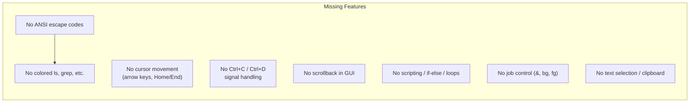

# Phase 5a: Shell & Terminal — Functional Improvement Plan

This plan covers the next development phase to transform KPIO's shell from a basic command executor into a feature-rich, interactive terminal experience. The improvements are prioritized by impact and dependency order.

---

## Current State Assessment

The existing shell has a solid foundation:

| Layer | File | Current Capabilities |
|-------|------|---------------------|
| Shell Engine | [shell.rs](file:///c:/Users/jin14/Projects/kernel-performed-illegal-operation/kernel/src/terminal/shell.rs) | Parsing, piping, redirection, chaining, aliases, env vars, history, tab completion |
| Commands | [commands.rs](file:///c:/Users/jin14/Projects/kernel-performed-illegal-operation/kernel/src/terminal/commands.rs) | 80+ Linux-compatible commands (2319 lines) |
| Filesystem | [fs.rs](file:///c:/Users/jin14/Projects/kernel-performed-illegal-operation/kernel/src/terminal/fs.rs) | In-memory VFS with dirs, files, symlinks, /proc |
| GUI Terminal | [window.rs](file:///c:/Users/jin14/Projects/kernel-performed-illegal-operation/kernel/src/gui/window.rs) | Basic rendering with text coloring via string-matching heuristics |
| Browser Terminal | [terminal.rs](file:///c:/Users/jin14/Projects/kernel-performed-illegal-operation/kpio-browser/src/apps/terminal.rs) | Full terminal emulator model (cursor, word-move, tabs, settings) — but disconnected from kernel shell |

### Key Gaps Identified



---

## Proposed Changes

### Priority 1 — Interactive Line Editing (High Impact, Foundation)

These changes make the terminal actually *usable* for daily interaction.

---

#### Component 1: ANSI Escape Code Engine

Add proper ANSI/VT100 escape sequence support so commands can output colored text, move the cursor, and clear regions.

##### [NEW] [ansi.rs](file:///c:/Users/jin14/Projects/kernel-performed-illegal-operation/kernel/src/terminal/ansi.rs)

New module implementing an ANSI escape code parser and styled text model:

- **`AnsiColor`** enum — 16 standard colors + 256 extended + RGB
- **`TextStyle`** struct — fg color, bg color, bold, italic, underline, dim, reverse
- **`StyledSpan`** struct — text segment + associated style
- **`StyledLine`** — `Vec<StyledSpan>` representing one rendered line
- **`AnsiParser`** — stateful parser that processes raw string output and produces `Vec<StyledLine>`:
  - CSI sequences: `\x1B[...m` (SGR — colors/attributes), `\x1B[nA/B/C/D` (cursor move), `\x1B[2J` (clear screen), `\x1B[K` (clear to EOL)
  - Simple state machine: Normal → Escape → CSI → Params → Execute
- **`parse_ansi(input: &str) -> Vec<StyledLine>`** — convenience function

##### [MODIFY] [commands.rs](file:///c:/Users/jin14/Projects/kernel-performed-illegal-operation/kernel/src/terminal/commands.rs)

Update key commands to emit ANSI color codes in their output:

- **`ls`** — directories in blue, executables in green, symlinks in cyan
- **`grep`** — matched text highlighted in red/bold
- **`diff`** — additions in green, deletions in red
- **`tree`** — directory names in blue
- **`help`** — section headers in bold, command names in green
- **`neofetch`** — ASCII art + labels in color
- **`cat -n`** — line numbers in dim/gray

##### [MODIFY] [window.rs](file:///c:/Users/jin14/Projects/kernel-performed-illegal-operation/kernel/src/gui/window.rs)

Replace the current string-matching color heuristic (lines 595–603) with proper ANSI-parsed styled rendering:

- Store `Vec<StyledLine>` instead of `Vec<String>` in `WindowContent::Terminal`
- Render each `StyledSpan` with its parsed color instead of guessing from content
- Map `AnsiColor` values to `Color` values from `TermTheme`

---

#### Component 2: Cursor Movement & Line Editing

Transform the terminal from append-only typing to a proper readline-like experience.

##### [MODIFY] [shell.rs](file:///c:/Users/jin14/Projects/kernel-performed-illegal-operation/kernel/src/terminal/shell.rs)

Add a `LineEditor` struct to `ShellState` for rich input editing:

```rust
pub struct LineEditor {
    pub buffer: Vec<char>,     // Input buffer as chars (Unicode-safe)
    pub cursor: usize,         // Cursor position within buffer
    pub saved_line: String,    // For history navigation (save current input)
    pub history_index: Option<usize>, // Current history position
}
```

Methods:
- `insert_char(c)` — insert at cursor, advance cursor
- `delete_back()` — backspace
- `delete_forward()` — Delete key
- `move_left() / move_right()` — arrow keys
- `move_word_left() / move_word_right()` — Ctrl+Left/Right
- `move_home() / move_end()` — Home/End
- `kill_line()` — Ctrl+K (delete to end)
- `kill_word_back()` — Ctrl+W (delete word backward)
- `clear_line()` — Ctrl+U (delete entire line)
- `transpose_chars()` — Ctrl+T
- `history_up() / history_down()` — ↑/↓ with saved-line semantics

##### [MODIFY] [window.rs](file:///c:/Users/jin14/Projects/kernel-performed-illegal-operation/kernel/src/gui/window.rs)

Extend `on_key` for terminal to handle special keys:

- Map scancodes for arrow keys, Home, End, Delete, PgUp, PgDn
- Handle Ctrl+key combos (Ctrl+C, Ctrl+D, Ctrl+L, Ctrl+W, Ctrl+U, Ctrl+K, Ctrl+A, Ctrl+E)
- Render cursor at the correct position within the input line (block cursor at `cursor` offset)
- Support cursor blink animation via timer tick

##### [MODIFY] [input.rs](file:///c:/Users/jin14/Projects/kernel-performed-illegal-operation/kernel/src/gui/input.rs)

Extend keyboard event model to pass through:
- Scancode-based special keys (arrows, Home, End, Delete, Insert, PgUp, PgDn)
- Modifier state (Ctrl, Alt, Shift) alongside the character

---

#### Component 3: Scrollback Buffer & Navigation

Allow scrolling through terminal history.

##### [MODIFY] [window.rs](file:///c:/Users/jin14/Projects/kernel-performed-illegal-operation/kernel/src/gui/window.rs)

- Add `scroll_offset: usize` to `WindowContent::Terminal` (or reuse existing `scroll_y`)
- **Shift+PgUp / Shift+PgDn** — scroll through line buffer
- **Shift+Home / Shift+End** — jump to top/bottom of scrollback
- **Mouse wheel** — scroll terminal output (integrate with existing mouse handling)
- Auto-scroll to bottom on new output
- Visual scroll indicator (thin bar on right side showing position)

> [!NOTE]
> The browser-side terminal (`kpio-browser/src/apps/terminal.rs`) already has a fully modeled scroll buffer with `scroll_up()`, `scroll_down()`, `scroll_to_bottom()`, and `visible_lines()` — we can port this logic directly.

---

### Priority 2 — Shell Language & Control Flow (Power Features)

These make the shell a proper scripting tool.

---

#### Component 4: Shell Scripting & Control Flow

Add `if/then/else/fi`, `for/do/done`, `while/do/done`, and `case/esac` to the shell parser.

##### [NEW] [script.rs](file:///c:/Users/jin14/Projects/kernel-performed-illegal-operation/kernel/src/terminal/script.rs)

New module implementing a simple shell script interpreter:

- **`ScriptNode`** AST enum:
  - `Simple(Pipeline)` — regular command
  - `If { condition, then_body, else_body }`
  - `For { var, items, body }`
  - `While { condition, body }`
  - `Case { expr, arms: Vec<(pattern, body)> }`
  - `Function { name, body }`
- **`parse_script(lines: &[String]) -> Vec<ScriptNode>`** — multi-line parser
- **`execute_script(nodes: &[ScriptNode]) -> Vec<String>`** — recursive evaluator
- **Variable assignment**: `VAR=value` syntax (no export needed for local scope)
- **Command substitution**: `` `command` `` or `$(command)`
- **Arithmetic**: `$((expr))` for basic integer math
- **`source` / `.` command** — execute a script file in current shell context

##### [MODIFY] [shell.rs](file:///c:/Users/jin14/Projects/kernel-performed-illegal-operation/kernel/src/terminal/shell.rs)

- Detect multi-line constructs (if the line ends with `then`, `do`, `{`, etc. → enter multi-line mode)
- Add a `pending_script: Vec<String>` buffer to `ShellState` to accumulate lines until a complete construct is parsed
- Modify prompt to show `>` continuation prompt during multi-line input
- Add `ShellState::functions: BTreeMap<String, Vec<String>>` for user-defined functions

##### [MODIFY] [commands.rs](file:///c:/Users/jin14/Projects/kernel-performed-illegal-operation/kernel/src/terminal/commands.rs)

Add new built-in commands:
- **`source`** / **`.`** — execute script file
- **`eval`** — evaluate a string as shell command
- **`read`** — read input into variable (simulated in no-input env)
- **`let`** / **`declare`** — variable declaration
- **`set`** — set shell options
- **`shift`** — shift positional parameters

##### [MODIFY] [mod.rs](file:///c:/Users/jin14/Projects/kernel-performed-illegal-operation/kernel/src/terminal/mod.rs)

Register the new `script` module.

---

#### Component 5: Job Control & Signals

Add background execution and basic signal handling.

##### [NEW] [jobs.rs](file:///c:/Users/jin14/Projects/kernel-performed-illegal-operation/kernel/src/terminal/jobs.rs)

New module managing background jobs:

- **`Job`** struct: `{ id: usize, command: String, status: JobStatus, output: Vec<String> }`
- **`JobStatus`** enum: `Running`, `Stopped`, `Done`
- **`JobManager`** — tracks active jobs, assigns job IDs (`[1]`, `[2]`, etc.)
- Background execution: `command &` syntax already partially handled in parser — connect it to job creation
- On completion, print `[1]+  Done   command_name`

##### [MODIFY] [shell.rs](file:///c:/Users/jin14/Projects/kernel-performed-illegal-operation/kernel/src/terminal/shell.rs)

- Detect `&` at end of pipeline → submit to job manager instead of blocking
- Add `ShellState::jobs: JobManager`

##### [MODIFY] [commands.rs](file:///c:/Users/jin14/Projects/kernel-performed-illegal-operation/kernel/src/terminal/commands.rs)

Add job-control commands:
- **`jobs`** — list background jobs
- **`fg [%n]`** — bring job to foreground
- **`bg [%n]`** — resume stopped job in background
- **`wait`** — wait for background jobs to complete
- **Ctrl+C** → set `interrupted` flag, stop current command
- **Ctrl+Z** → suspend (simulated — mark job as Stopped)

---

### Priority 3 — Quality-of-Life & Polish

---

#### Component 6: Text Selection, Clipboard & Extra Commands

##### [MODIFY] [window.rs](file:///c:/Users/jin14/Projects/kernel-performed-illegal-operation/kernel/src/gui/window.rs)

- **Mouse text selection** — click+drag to select text region in terminal
- **Ctrl+Shift+C** / **Ctrl+Shift+V** — copy/paste (internal clipboard buffer)
- **Double-click** to select word
- Visual highlight for selected region

##### [MODIFY] [commands.rs](file:///c:/Users/jin14/Projects/kernel-performed-illegal-operation/kernel/src/terminal/commands.rs)

Add missing utility commands popular in modern shells:
- **`watch`** — repeat command at interval (simulated single run with header)
- **`timeout`** — run command with time limit
- **`column`** — columnize input
- **`paste`** — merge lines of files
- **`split`** — split file into pieces
- **`comm`** — compare sorted files
- **`factor`** — print prime factors
- **`bc`** — basic calculator (integer arithmetic)
- **`jq`** — simple JSON pretty-printer / field extractor

---

## Summary of New & Modified Files

| Action | File | Component |
|--------|------|-----------|
| **NEW** | `kernel/src/terminal/ansi.rs` | ANSI escape code parser |
| **NEW** | `kernel/src/terminal/script.rs` | Shell scripting engine |
| **NEW** | `kernel/src/terminal/jobs.rs` | Job control manager |
| **MODIFY** | `kernel/src/terminal/mod.rs` | Register new modules |
| **MODIFY** | `kernel/src/terminal/shell.rs` | LineEditor, scripting state, job manager |
| **MODIFY** | `kernel/src/terminal/commands.rs` | Colored output, new commands |
| **MODIFY** | `kernel/src/gui/window.rs` | ANSI rendering, cursor, scrollback, selection |
| **MODIFY** | `kernel/src/gui/input.rs` | Extended key/modifier events |

---

## Verification Plan

### Automated Tests

Tests will validate each component in isolation:

```bash
# Build the kernel (checks for compilation errors)
cargo build --release

# Run unit tests for the terminal module
cargo test --lib -- terminal
```

### Manual Verification

1. **ANSI colors** — Run `ls`, `grep pattern file`, `diff`, `neofetch` and confirm colored output in the GUI terminal
2. **Cursor editing** — Type text, press ← → Home End, verify cursor moves correctly; type in the middle of a line
3. **Ctrl shortcuts** — Ctrl+C clears input, Ctrl+L clears screen, Ctrl+W deletes word
4. **Scrollback** — Fill terminal with output (`seq 1 200`), scroll up with Shift+PgUp, scroll down
5. **Scripting** — Create and run a script with `if`/`for`:
   ```bash
   echo '#!/bin/ksh' > test.sh
   echo 'for i in 1 2 3; do echo "Item $i"; done' >> test.sh
   source test.sh
   ```
6. **Job control** — Run `sleep 5 &`, check `jobs`, then `fg %1`
7. **QEMU boot test** — Full boot → GUI desktop → open Terminal → execute commands → verify rendering

---

## Recommended Implementation Order

```mermaid
gantt
    title Implementation Order
    dateFormat X
    axisFormat %s

    section P1: Foundation
    ANSI Parser (ansi.rs)         :a1, 0, 3
    Colored command output        :a2, after a1, 2
    GUI ANSI rendering            :a3, after a1, 2
    
    section P1: Line Editing
    LineEditor in shell.rs        :b1, 0, 2
    Extended key events (input.rs):b2, 0, 1
    GUI cursor/key handling       :b3, after b1, 2
    
    section P1: Scrollback
    Scroll buffer + navigation    :c1, after a3, 2
    
    section P2: Scripting
    Script parser (script.rs)     :d1, after c1, 4
    Multi-line mode in shell      :d2, after d1, 1
    
    section P2: Job Control
    Job manager (jobs.rs)         :e1, after d2, 3
    
    section P3: Polish
    Text selection / clipboard    :f1, after e1, 2
    Extra commands                :f2, after e1, 2
```



> [!IMPORTANT]
> **Priority 1 components (ANSI, Line Editing, Scrollback) should be implemented first** — they provide the most visible improvement to daily usability and are prerequisites for the scripting and job control features.

> [!TIP]
> The `kpio-browser/src/apps/terminal.rs` file already has well-designed models for `TerminalBuffer` (scroll), cursor word-movement, and `TerminalSettings` — these can be directly adapted for the kernel-side terminal to avoid duplicating design work.
